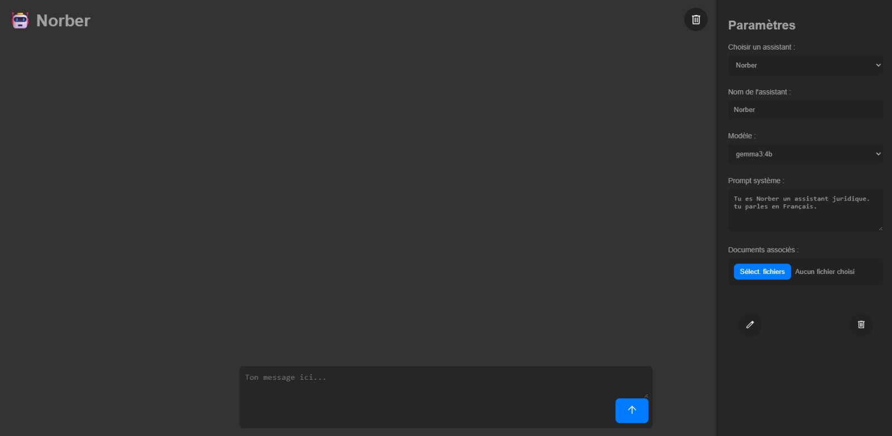

# 🧠 Assistant IA local avec RAG + Agents (`image`, `calc`)

Assistant personnel en local, alimenté par **Ollama**, avec recherche contextuelle (RAG) sur vos documents et **agents spécialisés** :

- `--image un panda dans la neige` → Génère une image avec Stable Diffusion
- `--calc 249 / 4 + 6 * 2` → Effectue un calcul local sécurisé

---

## ✅ Prérequis système

- Windows 10 ou 11 (64 bits)
- Node.js LTS : https://nodejs.org/
- Python 3.10.x (impératif pour Stable Diffusion) : https://www.python.org/downloads/release/python-3100/
- Git (fortement recommandé pour cloner AUTOMATIC1111)

---

## 📦 Dépendances

### 1. Ollama

- Télécharger Ollama pour Windows : https://ollama.com/download
- Lancer l'application (reste active en tâche de fond sur `localhost:11434`)
- Télécharger un modèle : ex. via terminal
  ollama run mistral

### 2. Stable Diffusion WebUI (AUTOMATIC1111)

- Cloner le repo : https://github.com/AUTOMATIC1111/stable-diffusion-webui
- Télécharger au moins un modèle `.safetensors` ou `.ckpt` (ex: Realistic Vision, DreamShaper…)
- Placer le fichier dans le dossier : `models/Stable-diffusion/`

---

## ⚙️ Configuration de `webui-user.bat`

Ouvre le fichier `webui-user.bat` et remplace son contenu par :

@echo off

set PYTHON=py -3.10
set GIT=
set VENV_DIR=
set COMMANDLINE_ARGS=--api --cors-allow-origins=http://localhost:5173

call webui.bat

Explication :
- `--api` : active l'API utilisée par l'agent `--image`
- `--cors-allow-origins=http://localhost:5173` : autorise les requêtes de ton app React

---

## 🚀 Lancement

### 1. Lancer Stable Diffusion

Double-clique sur `webui-user.bat`  
→ l'API sera disponible sur `http://127.0.0.1:7860`

### 2. Lancer Ollama

Lancer l'application Ollama (ou s'assurer qu’elle tourne en tâche de fond)

### 3. Lancer ton assistant

Dans ton dossier de projet :

npm install
npm run dev

Ouvre ensuite : http://localhost:5174/

---

## 🧠 Utilisation des agents

### Agent `image`

--image un chat en armure médiévale dans un champ de bataille

→ L'agent traduit automatiquement le prompt en anglais puis appelle Stable Diffusion (via l'API locale)

### Agent `calc`

--calc (249 / 4) + (3 x 6)

→ L'agent interprète l'expression et renvoie le résultat dans une boîte de code

---

## 🗃️ Fonctionnalités

- Création d'assistants personnalisés avec nom, modèle, prompt système
- Association de documents locaux (lecture + résumé possible)
- Historique de discussion propre à chaque assistant
- Exécution d'agents via commandes spéciales

## dev mode css
  npx gulp watch

  